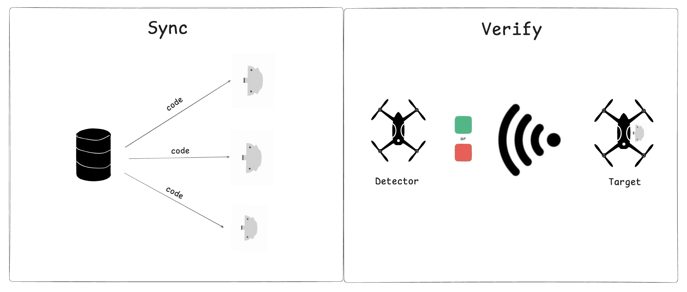
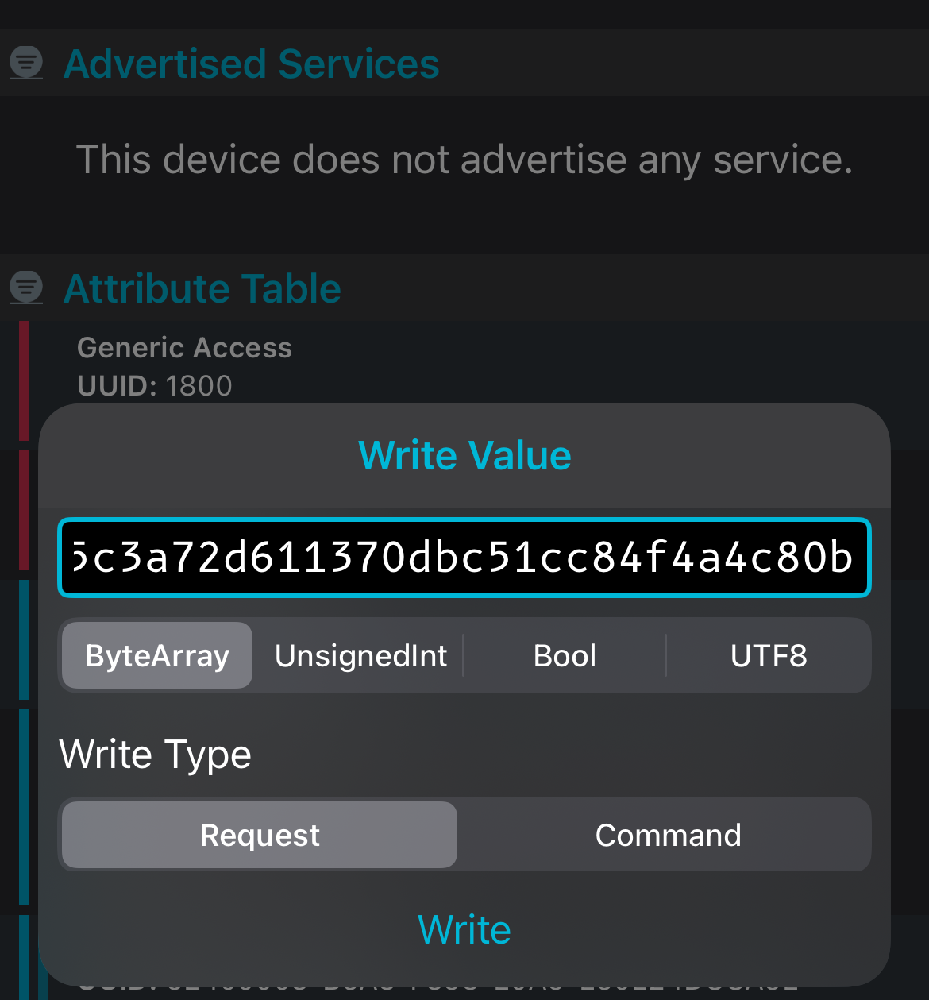
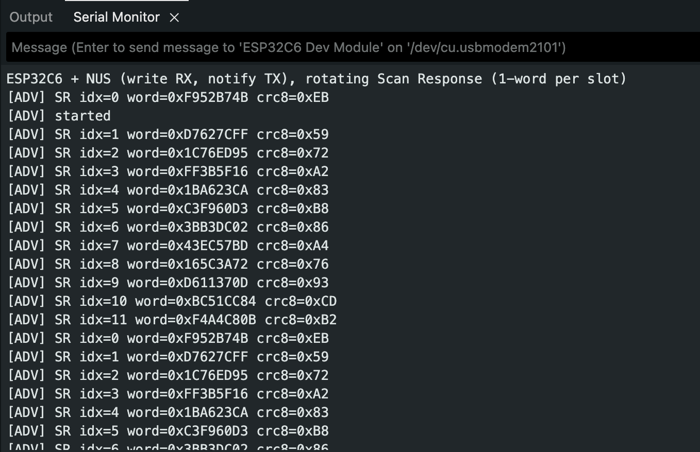
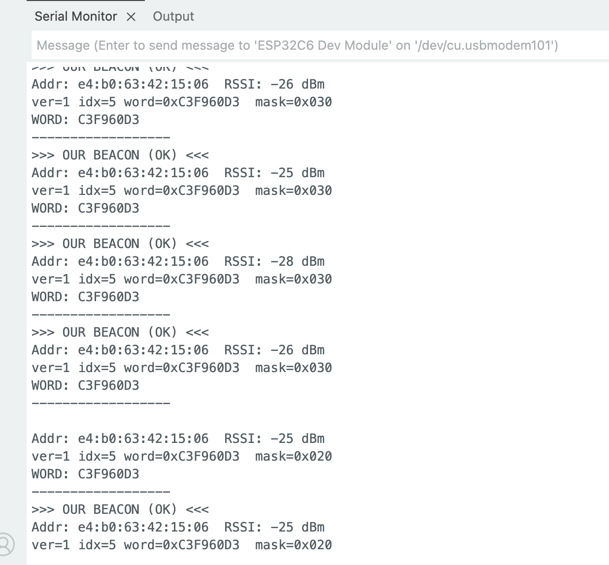

# core

Kolu is an identification friend or foe (IFF) system for drones designed to help Ukrainian military on the battlefield. The system is made of a KOLU device and a communication protocol. 

The system is **scalable**. The devices are cheap (< $5) and can be sticked to existing drones without requiring any hardware or software integration.

The system is **secure**. The communication protocol uses cryptography to guarantee that an enemy cannot pretend to be a friend.

The goal of the system is to reduce the drone friendly fire rate.

## Communication protocol overview 



The protocol is made of two main phases. 

The Sync phase is run at the beginning of each epoch. In this phase a central server generates, via `CodeGen()`, an epoch-specific secret `code` that is then uploaded inside the KOLU device via `Upload()`. The code consists of a sequence of `N` pseudo-random blocks of bits where the i-th block corresponds to expected sequence of bits at the i-th sub-epoch. The KOLU devices are then sticked over the drones.

While in fly, the KOLU device `Stream()` a signal according to the sub-epoch they are in. To verify whether a drone is `FriendOrFoe()`, the detector drone detects the bluetooth signal coming out of the Kolu device attached to the target drone and compares it with the expected block for that sub-epoch. If the block matches, then the drone is friend. If the code doesn't match, then the drone is Foe. Given the pseudo-randomness nature of the secret code, the possibility that the enemy is able to guess it is negligible.

#### `CodeGen()`

```
Inputs: 
seed // generated via TRANSEC key
epoch_length // seconds 
sub_epoch_length // seconds 
block_bit_length 

N = div_floor(epoch_length/sub_epoch_length)

for i in 0...N
    code[i] = CSPRNG(seed, i, block_bit_length)

Output:
code 
```

#### `Upload()`

Requires authentication: Kolu devie should makes sure that only an authorized deviced can upload the `code`

#### `Stream()`

```
Inputs: 
code 
sub_epoch_id 

Output:
code[sub_epoch_id]
```

#### `FriendOrFoe()`


```
Inputs: 
code 
signal // collected from the target drone  
sub_epoch_id 

Output:
signal == code[sub_epoch_id]
```

## End to end run

#### `CodeGen()`

Located in `/codegen` folder

```shell
❯ cargo run -- deadbeef 3600 300 32 

Generating 12 code blocks...
Parameters:
  Seed: deadbeef
  Epoch length: 3600 seconds
  Sub-epoch length: 300 seconds
  Block bit length: 32 bits

Generated codes:
  code[0] = f952b74b
  code[1] = d7627cff
  code[2] = 1c76ed95
  code[3] = ff3b5f16
  code[4] = 1ba623ca
  code[5] = c3f960d3
  code[6] = 3bb3dc02
  code[7] = 43ec57bd
  code[8] = 165c3a72
  code[9] = d611370d
  code[10] = bc51cc84
  code[11] = f4a4c80b

Concatenated code: f952b74bd7627cff1c76ed95ff3b5f161ba623cac3f960d33bb3dc0243ec57bd165c3a72d611370dbc51cc84f4a4c80b
```

#### `Upload()`



#### `Stream()`

Code available on `/esp32/sender.ino`



#### `FriendOrFoe()`

Code available on `/esp32/receiver.ino`

Receive message:

