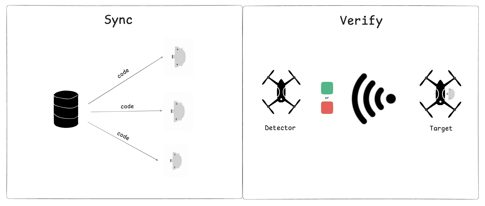

# core

Kolu is an identification friend or foe (IFF) system for drones designed to help Ukrainian military on the battlefield. The system is made of a KOLU device and a communication protocol. 

The system is **scalable**. The devices are cheap (< $5) and can be sticked to existing drones without requiring any hardware or software integration.

The system is **secure**. The communication protocol uses cryptography to guarantee that an enemy cannot pretend to be a friend.

The goal of the system is to reduce the drone friendly fire rate.

## Communication protocol overview 



The protocol is made of two main phases. 

The Sync phase is run at the beginning of each epoch. In this phase a central server generates, via `CodeGen()`, an epoch-specific secret `code` that is then uploaded inside the KOLU device via `Upload()`. The code consists of a sequence of `N` pseudo-random blocks of bits where the i-th block corresponds to expected sequence of bits at the i-th sub-epoch. The KOLU devices are then sticked over the drones.

While in fly, the KOLU device `Stream()` a signal according to the sub-epoch they are in. To verify whether a drone is `FriendOrFoe()`, the detector drone detects the bluetooth signal coming out of the Kolu device attached to the target drone and compares it with the expected block for that sub-epoch. If the block matches, then the drone is friend. If the code doesn't match, then the drone is Foe. Given the pseudo-randomness nature of the secret code, the possibility that the enemy is able to guess it is negligible.

#### `CodeGen()`

```
Inputs: 
seed // generated via TRANSEC key
epoch_length // seconds 
sub_epoch_length // seconds 
block_bit_length 

N = div_floor(epoch_length/sub_epoch_length)

for i in 0...N
    code[i] = CSPRNG(seed, i, block_bit_length)

Output:
code 
```

#### `Upload()`

Requires authentication: Kolu devie should makes sure that only an authorized deviced can upload the `code`

#### `Stream()`

```
Inputs: 
code 
sub_epoch_id 

Output:
code[sub_epoch_id]
```

#### `FriendOrFoe()`


```
Inputs: 
code 
signal // collected from the target drone  
sub_epoch_id 

Output:
signal == code[sub_epoch_id]
```


## codegen

```shell
❯ cargo run -- deadbeef 3600 300 256
   Compiling codegen v0.1.0 (/Users/piapark/Documents/GitHub/core/codegen)
    Finished `dev` profile [unoptimized + debuginfo] target(s) in 0.30s
     Running `target/debug/codegen deadbeef 3600 300 256`
Generating 12 code blocks...
Parameters:
  Seed: deadbeef
  Epoch length: 3600 seconds
  Sub-epoch length: 300 seconds
  Block bit length: 256 bits

Generated codes:
  code[0] = f952b74bc7d6d96ff054ffd215e8963bf023fec9592025f6341c680d8c902fe5
  code[1] = d7627cff49dc550e25ef3a76375cf67d3763138873f87182ec7ee7f985ac1aa3
  code[2] = 1c76ed950227160f1abfb86a1958cdc366510938d2298e14f9f5517335cbcd4c
  code[3] = ff3b5f16d7f429ff049f4d175c4b3516d7e5d95196cb8ce99e8a24c43b5ab522
  code[4] = 1ba623cad99e22c0b9267024603f9d28f1aa3ef7ad5001a3141079680d25a882
  code[5] = c3f960d37539c900bd26dca5148e4cd7547dfbb12ecf267e45b2f61f86f3eb7b
  code[6] = 3bb3dc0265cb83e47b2c50a7ba428202f1ac37e1a0db8d1a449ee83b84e6f3d6
  code[7] = 43ec57bd6e05977f393f7f57ff1cf1f376f70dbf558e5898927e7277f0d92b72
  code[8] = 165c3a72c3afde1790c13c500b8e5ccd22ab4f084330b67c5fe2eaf13955c5b0
  code[9] = d611370d71e4586b8a1bcf75bf4ef552e3d71afe54aadfac39f23ad8123a1ff2
  code[10] = bc51cc8480cd7bd2b9f0577efce42280ce24a5c04c06045c100d783cc4be393c
  code[11] = f4a4c80bf292bbd77cd8e5bf611b12d9b046fb0f74a45d9be6c3f2392cc84a1e

Concatenated code: f952b74bc7d6d96ff054ffd215e8963bf023fec9592025f6341c680d8c902fe5d7627cff49dc550e25ef3a76375cf67d3763138873f87182ec7ee7f985ac1aa31c76ed950227160f1abfb86a1958cdc366510938d2298e14f9f5517335cbcd4cff3b5f16d7f429ff049f4d175c4b3516d7e5d95196cb8ce99e8a24c43b5ab5221ba623cad99e22c0b9267024603f9d28f1aa3ef7ad5001a3141079680d25a882c3f960d37539c900bd26dca5148e4cd7547dfbb12ecf267e45b2f61f86f3eb7b3bb3dc0265cb83e47b2c50a7ba428202f1ac37e1a0db8d1a449ee83b84e6f3d643ec57bd6e05977f393f7f57ff1cf1f376f70dbf558e5898927e7277f0d92b72165c3a72c3afde1790c13c500b8e5ccd22ab4f084330b67c5fe2eaf13955c5b0d611370d71e4586b8a1bcf75bf4ef552e3d71afe54aadfac39f23ad8123a1ff2bc51cc8480cd7bd2b9f0577efce42280ce24a5c04c06045c100d783cc4be393cf4a4c80bf292bbd77cd8e5bf611b12d9b046fb0f74a45d9be6c3f2392cc84a1e
```
